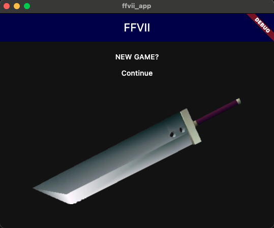

# FFVII-GUI

A flutter app built to re-imagining FFVII.

## initial setup tasks
- semantic release versioning (using a flutter native approach)
- unit tests
- required dependencies
- target flutter version

### packages

- `riverpod`: state management
- `dio`: HTTP client
- `riverpod_lint` + custom_lint: simplify code + provide riverpod usage improvements

## required 1.0 features



- launch a start screen ✅
- select new game
  -  create a new save slot, and 
     -  list availabe party members
     -  select a save location
     -  display party base party info on a new screen
- select continue ✅
  - list all the found save slots from API ✅
    - show the party members, lead member + lead level, save location ✅
  - list a maximum of 15 slots
  - show EMPTY is no save slot is found
  - select a slot to load that save
    - display party base party info on a new screen


## supported platforms

- Desktop (Mac, Windows, Linux)
- Web (Chrome, Firefox)

> [!CAUTION]
> Is runnable on android/ios however the app is not *yet* gracefully handling smaller screensizes.

## project structure

```
├── assets
│   ├── ff7-sword.png
│   ├── main-menu.png
│   ├── profile-aeris.jpg
│   ├── profile-barret.jpg
│   ├── profile-cait sith.jpg
│   ├── profile-cid.jpg
│   ├── profile-cloud.jpg
│   ├── profile-red xiii.jpg
│   ├── profile-tifa.jpg
│   ├── profile-vincent.jpg
│   ├── profile-yuffie.jpg
│   └── save-slots.png
── lib
│   ├── main.dart
│   ├── models
│   │   └── save.dart
│   ├── party_details_page.dart
│   ├── providers
│   │   └── saves_provider.dart
│   ├── repository - TODO
│   ├── save_slot_widget.dart
│   ├── saves_page.dart
│   └── services
│       └── saves_service.dart
```