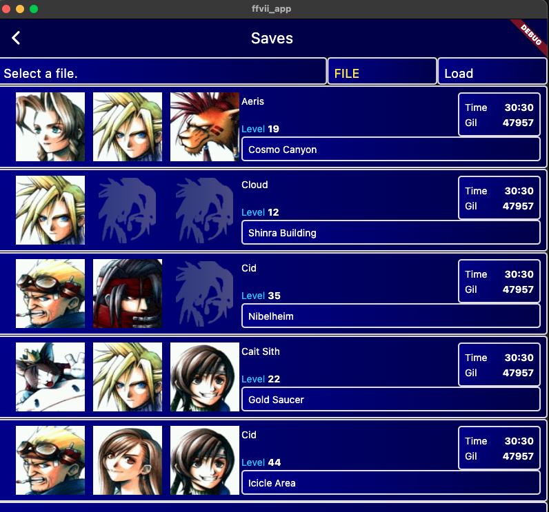

# FFVII-GUI

A Flutter app built to re-imagine the original FFVII.

- [FFVII-GUI](#ffvii-gui)
    - [packages](#packages)
  - [progress](#progress)
    - [desktop](#desktop)
    - [mobile](#mobile)
  - [required 1.0 features](#required-10-features)
  - [supported platforms](#supported-platforms)
  - [building](#building)
  - [project structure](#project-structure)
  - [assets](#assets)
  - [findings](#findings)


### packages

- `riverpod`: state management
- `dio`: HTTP client
- `riverpod_lint` + custom_lint: simplify code + provide riverpod usage improvements
- `custom_mouse_cursor`: used to mimic original glove cursor (desktop only)
- `package_info_plus`: used to obtain app install + version info.

## progress

### desktop


### mobile


## required 1.0 features

- launch a start screen ✅
- select new game 🚧
  -  create a new save slot, and 
     -  list availabe party members
     -  select a save location
     -  display party base party info on a new screen
- select continue ✅
  - list all the found save slots from API ✅
    - show the party members, lead member + lead level, save location ✅
  - list a maximum of 15 slots ✅
  - show EMPTY is no save slot is found ✅
  - select a slot to load that save 🚧
    - display party base party info on a new screen


## supported platforms

> [!WARNING]
> Mobile and Web are being prioritized. Desktop apps will be assessed at a later point.

- **Web**: 🚧  refactor underway, *was* functional ...
- **iOS**: ✅ good status, api calls + UI functional
- **Android**: ✅ good status, api calls  + UI functional
- **Desktop**: ✅ Mac good status,  api calls + UI functional, 🚫 untested on Linux/Windows

## building

Build app with config: `flutter build apk --dart-define-from-file=config.prod.json`

Run app with config: `flutter run --dart-define-from-file=config.prod.json`


## project structure

```
assets
lib
├── models
├── pages
├── providers
├── repository
├── services
└── widgets
```

## assets

- https://www.spriters-resource.com/pc_computer/finalfantasy7/asset/39057/


## findings

- use Containers to colour widget areas on screen, use these coloured boxes to help shape & size your layout easily. Once you have your layout as desired across mobile/desktop,then replace with your real widgets
- split up widgets that are reusable, make modular widgets but also keep widgets specific. Not everything has to be a single, atomic entity
- test on real device, don't trust simulator
- enable internet permissions for Mac, android, ios apps
- enable CORS on API server
- a black icon app was having different effects on android
- riverpod guide: https://codewithandrea.com/articles/flutter-state-management-riverpod/