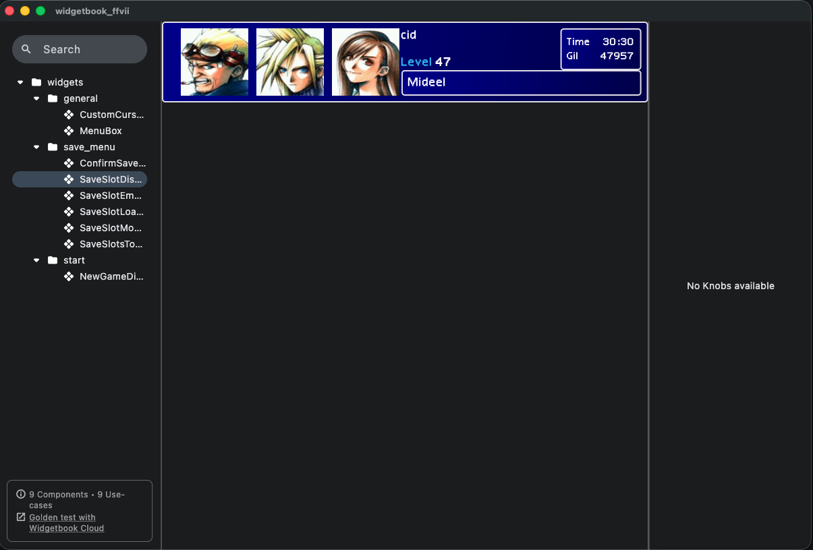

# widgetbook

Run this app to walkthrough all the ffvii app's widgets individually. 

## widgetbook

Used to display all the widgets used in app. The widget folder structure in `./widgetbook/lib` matches main app widgets in `./lib/widgets`. When adding new widgets,

1. `cd ./widgetbook`
2. run `dart run build_runner build -d` to update widgetbook
3. run `flutter run -d web-server --web-port={{PORT}}` to access in web

> [!WARNING]
> Widgets need decoupling from data to allow simplified rendering in widgetbook, without relying on domain logic. Here the widgets should ideally run with as little manipulation as possible. 
> 
> Currently, widgets exist that have data tied to their definition, making more work to get a widget simply running in widgetbook.